# Authentication Flow Diagram

This diagram illustrates the authentication flows for MyPromptPocket application, including registration, login (both email/password and Google OAuth), password recovery, session management, and logout processes.

```mermaid
sequenceDiagram
    autonumber
    participant User
    participant Browser
    participant Astro as Astro Server
    participant Supabase as Supabase Auth
    participant Google as Google OAuth

    Note over User,Google: Registration Flow

    User->>Browser: Opens registration page
    Browser->>Astro: Request /auth/register
    Astro->>Browser: Serve registration page
    User->>Browser: Fills registration form
    Browser->>Browser: Client-side validation

    Browser->>Supabase: signUp(email, password)
    activate Supabase
    Supabase->>Browser: Registration response
    deactivate Supabase

    alt Registration successful
        Browser->>User: Show success message
        Browser->>Astro: Redirect to /auth/login
    else Registration failed
        Browser->>User: Display error message
    end

    Note over User,Google: Email/Password Login Flow

    User->>Browser: Opens login page
    Browser->>Astro: Request /auth/login
    Astro->>Browser: Serve login page
    User->>Browser: Enters email & password
    Browser->>Browser: Validate form inputs

    Browser->>Supabase: signInWithPassword(email, password)
    activate Supabase
    Supabase->>Browser: Authentication response with session
    deactivate Supabase

    alt Authentication successful
        Browser->>Browser: Store session in cookies
        Browser->>Astro: Redirect to app home
    else Authentication failed
        Browser->>User: Show error message
    end

    Note over User,Google: Google OAuth Login Flow

    User->>Browser: Clicks "Login with Google"
    Browser->>Supabase: signInWithOAuth("google")
    Supabase->>Google: Redirect to Google login
    User->>Google: Authenticates with Google
    Google->>Supabase: OAuth callback with token
    Supabase->>Browser: Redirect to /auth/callback with session

    Browser->>Astro: Process callback
    Astro->>Browser: Store session and redirect to app

    Note over User,Google: Password Recovery Flow

    User->>Browser: Clicks "Forgot Password"
    Browser->>Astro: Request /auth/forgot-password
    Astro->>Browser: Serve forgot password page
    User->>Browser: Enters email address

    Browser->>Supabase: resetPasswordForEmail(email)
    Supabase->>User: Send password reset email
    User->>Browser: Clicks reset link in email
    Browser->>Astro: Request /auth/reset-password
    Astro->>Browser: Serve reset password page

    User->>Browser: Enters new password
    Browser->>Supabase: updateUser({ password })
    Supabase->>Browser: Password update response

    alt Password reset successful
        Browser->>User: Show success message
        Browser->>Astro: Redirect to /auth/login
    else Password reset failed
        Browser->>User: Show error message
    end

    Note over User,Google: Protected Route Access

    User->>Browser: Navigates to protected page
    Browser->>Astro: Request protected route

    activate Astro
    Astro->>Supabase: getSession()
    Supabase->>Astro: Return session data

    alt Valid session
        Astro->>Browser: Serve requested page with user data
    else No valid session
        Astro->>Browser: Redirect to /auth/login
    end
    deactivate Astro

    Note over User,Google: Logout Flow

    User->>Browser: Clicks logout button
    Browser->>Supabase: signOut()
    Supabase->>Browser: Clear session
    Browser->>Browser: Clear auth state
    Browser->>Astro: Redirect to /auth/login
    Astro->>Browser: Serve login page

    Note over User,Google: Session Refresh (Background Process)

    Browser->>Supabase: Auto refresh token near expiration
    Supabase->>Browser: Return refreshed session
    Browser->>Browser: Update stored session
```

## Authentication Flow Details

### Registration Flow

1. User initiates registration by filling out the form with email and password
2. Client-side validation ensures data format and password strength requirements
3. Supabase Auth creates the user account
4. User receives success confirmation and is redirected to login

### Email/Password Login

1. User provides email and password credentials
2. Supabase Auth validates credentials and returns a session
3. Session is securely stored in cookies
4. User is redirected to the application main page

### Google OAuth Login

1. User initiates Google authentication
2. Supabase Auth redirects to Google for authentication
3. After successful authentication, Google returns to callback URL
4. Session is established and user is redirected to the application

### Password Recovery

1. User requests password reset by providing email
2. Reset link is sent to user's email
3. User sets new password via reset form
4. After successful password update, user is redirected to login

### Protected Route Access

1. Server checks for valid session on each request to protected routes
2. Invalid or missing sessions trigger redirect to login page
3. User data is made available to application components when authenticated

### Logout Process

1. User initiates logout
2. Session is terminated on Supabase
3. Local auth state is cleared
4. User is redirected to login page

### Session Management

1. Tokens are refreshed automatically before expiration
2. Session state is synchronized between client and server
3. Secure cookie storage prevents unauthorized access
