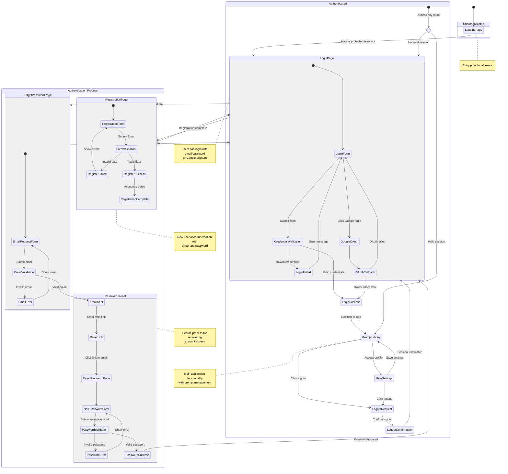

# User Journey Flow Diagram

This diagram illustrates the user journey flow for authentication in MyPromptPocket, including registration, login, password recovery, and protected route access.

## User Journey Analysis

1. Main user paths:

   - New user registration
   - Email/password login
   - Google OAuth login
   - Password recovery
   - Protected route access
   - Logout process

2. Main states:

   - Unauthenticated: Landing page, Login form, Registration form, Password recovery
   - Authentication process: Form validation, Credentials verification, OAuth flow
   - Authenticated: Main application (prompt library), User settings, Logout

3. Decision points:
   - Registration form validation
   - Login credentials verification
   - Password reset token validation
   - Session validation for protected routes

## Journey Flow Details

### Unauthenticated User Flow

1. User lands on the application landing page
2. When trying to access protected resources, user is redirected to login page
3. From login page, user can:
   - Login with email and password
   - Login with Google account
   - Navigate to registration page
   - Request password reset

### Registration Process

1. User fills registration form with email and password
2. System validates input data (email format, password strength)
3. On successful validation, account is created
4. User is redirected to login page with success message

### Login Process

1. User provides credentials (email/password or Google account)
2. System verifies credentials
3. On successful authentication, user is redirected to main application
4. On failed authentication, error message is displayed

### Password Recovery

1. User requests password reset by providing email
2. System sends email with reset link
3. User clicks link and accesses reset password page
4. User enters and confirms new password
5. On successful password change, user is redirected to login page

### Protected Route Access

1. System checks for valid session on each request to protected routes
2. Users with valid session access requested resources
3. Users without valid session are redirected to login page

### Logout Process

1. User initiates logout from any authenticated page
2. System confirms logout action
3. Session is terminated
4. User is redirected to login page
