# Authentication UI Architecture Diagram

This diagram illustrates the UI architecture of the authentication system for MyPromptPocket, showing the relationship between Astro pages, React components, and authentication services.

## Architecture Analysis

1. Main components:

   - **Astro Pages**: Login, Register, Forgot Password, Reset Password, Callback
   - **Layouts**: AuthLayout for authentication pages, AppLayout for protected content
   - **React Components**: Various form components for authentication actions
   - **Services**: Login, Registration, Password Reset
   - **Hooks**: Authentication state management
   - **Utilities**: Form validation, error handling

2. Key data flows:

   - User input → Form components → Validation → Auth services → Supabase
   - Supabase responses → Auth services → Component state → UI updates
   - Session data → Protected route checks → Conditional rendering

3. Component responsibilities:
   - **Pages**: Route handling and component composition
   - **Layouts**: Consistent UI structure and authentication checks
   - **Form Components**: User input and form submission
   - **Services**: Authentication API interactions
   - **Hooks**: State management and auth context

```mermaid
flowchart TD
    %% Main Application Entry
    AppEntry([Application Entry])

    %% Authentication Pages
    subgraph "Authentication Pages"
        direction TB
        Login["login.astro\nLogin Page"]
        Register["register.astro\nRegistration Page"]
        ForgotPwd["forgot-password.astro\nPassword Recovery"]
        ResetPwd["reset-password.astro\nNew Password"]
        Callback["callback.astro\nOAuth Handler"]
    end

    %% Layouts
    subgraph "Layouts"
        AuthLayout["AuthLayout.astro\nAuth Pages Layout"]
        AppLayout["AppLayout.astro\nAuthenticated Layout"]
    end

    %% React Components
    subgraph "React Components"
        direction TB
        subgraph "Auth Forms"
            LoginForm["LoginForm.tsx\nEmail/Password Login"]
            RegisterForm["RegisterForm.tsx\nUser Registration"]
            ForgotPwdForm["ForgotPasswordForm.tsx\nRequest Reset"]
            ResetPwdForm["ResetPasswordForm.tsx\nNew Password"]
            GoogleBtn["GoogleAuthButton.tsx\nGoogle OAuth"]
        end

        subgraph "UI Components"
            FormInput["Input Fields"]
            FormButton["Buttons"]
            AlertComp["Alert Messages"]
            LoadingSpinner["Loading Indicators"]
        end
    end

    %% Services and Utilities
    subgraph "Auth Services"
        LoginSvc["login-service.ts\nAuthentication"]
        RegisterSvc["register-service.ts\nUser Registration"]
        ResetPwdSvc["reset-password-service.ts\nPassword Reset"]
    end

    subgraph "Utilities"
        Validation["validation.ts\nForm Validation"]
        ErrorHandling["error-handling.ts\nError Processing"]
    end

    %% Shared Hooks and Context
    subgraph "State Management"
        AuthHook["useAuth.ts\nAuth Hook"]
        AuthContext["Auth Context"]
    end

    %% Backend Integration
    SupabaseAuth["Supabase Auth API"]

    %% Protected Application
    PromptLibrary["Protected Application\nPrompt Library"]

    %% Connections between components

    %% Entry points to pages
    AppEntry --> Login
    AppEntry --> Register
    AppEntry --> ForgotPwd
    AppEntry --> ResetPwd
    AppEntry --> Callback
    AppEntry --> AppLayout

    %% Pages use layouts
    Login --> AuthLayout
    Register --> AuthLayout
    ForgotPwd --> AuthLayout
    ResetPwd --> AuthLayout

    %% Pages incorporate React components
    Login --> LoginForm
    Register --> RegisterForm
    ForgotPwd --> ForgotPwdForm
    ResetPwd --> ResetPwdForm

    %% Form components use UI components
    LoginForm --> FormInput
    LoginForm --> FormButton
    LoginForm --> AlertComp
    LoginForm --> LoadingSpinner
    LoginForm --> GoogleBtn
    RegisterForm --> FormInput
    RegisterForm --> FormButton
    RegisterForm --> AlertComp
    RegisterForm --> LoadingSpinner
    ForgotPwdForm --> FormInput
    ForgotPwdForm --> FormButton
    ForgotPwdForm --> AlertComp
    ResetPwdForm --> FormInput
    ResetPwdForm --> FormButton
    ResetPwdForm --> AlertComp

    %% Form components use validation and hooks
    LoginForm --> Validation
    RegisterForm --> Validation
    ForgotPwdForm --> Validation
    ResetPwdForm --> Validation

    LoginForm --> AuthHook
    RegisterForm --> AuthHook
    GoogleBtn --> AuthHook

    %% Services used by forms
    LoginForm --> LoginSvc
    RegisterForm --> RegisterSvc
    ForgotPwdForm --> ResetPwdSvc
    ResetPwdForm --> ResetPwdSvc
    GoogleBtn --> LoginSvc

    %% Services connect to Supabase
    LoginSvc --> SupabaseAuth
    RegisterSvc --> SupabaseAuth
    ResetPwdSvc --> SupabaseAuth

    %% Auth hook manages context
    AuthHook <--> AuthContext

    %% Callback handles OAuth
    Callback --> SupabaseAuth
    Callback --> AuthContext

    %% Protected routes use AppLayout
    AppLayout --> AuthContext
    AppLayout -- "Valid Session" --> PromptLibrary
    AppLayout -- "Invalid Session" --> Login

    %% Error handling throughout the system
    LoginSvc --> ErrorHandling
    RegisterSvc --> ErrorHandling
    ResetPwdSvc --> ErrorHandling

    %% Style definitions
    classDef page fill:#f9f,stroke:#333,stroke-width:1px;
    classDef layout fill:#bbf,stroke:#333,stroke-width:1px;
    classDef component fill:#bfb,stroke:#333,stroke-width:1px;
    classDef service fill:#fbb,stroke:#333,stroke-width:1px;
    classDef utility fill:#ffc,stroke:#333,stroke-width:1px;
    classDef state fill:#bbf,stroke:#333,stroke-width:1px;
    classDef external fill:#ddd,stroke:#333,stroke-width:1px;

    %% Apply styles
    class Login,Register,ForgotPwd,ResetPwd,Callback page;
    class AuthLayout,AppLayout layout;
    class LoginForm,RegisterForm,ForgotPwdForm,ResetPwdForm,GoogleBtn,FormInput,FormButton,AlertComp,LoadingSpinner component;
    class LoginSvc,RegisterSvc,ResetPwdSvc service;
    class Validation,ErrorHandling utility;
    class AuthHook,AuthContext state;
    class SupabaseAuth external;
```

## Authentication UI Flow Description

### Entry and Navigation

The application entry point routes users to different authentication pages based on their needs:

1. Login page for returning users
2. Registration page for new users
3. Password recovery for users who forgot their credentials
4. OAuth callback for handling third-party authentication

### Page Structure

Each authentication page follows a consistent pattern:

- Uses the `AuthLayout` for consistent styling and branding
- Incorporates React components for interactive elements
- Connects to authentication services for backend operations

### Component Hierarchy

1. **Astro Pages** serve as containers and route handlers
2. **Layouts** provide consistent structure and authentication checks
3. **React Components** handle user interactions:
   - Form components for data collection
   - UI components for presentation
4. **Services** manage communication with the authentication backend
5. **Utilities** provide shared functionality like validation

### Authentication Flow

1. **User Input**:

   - Users interact with form components
   - Client-side validation provides immediate feedback

2. **Authentication Processing**:

   - Form data is sent to authentication services
   - Services communicate with Supabase Auth API
   - Responses are processed and handled appropriately

3. **State Management**:

   - The authentication hook (`useAuth`) and context manage session state
   - Components react to authentication state changes
   - Protected routes check for valid sessions

4. **Protected Content Access**:
   - `AppLayout` verifies authentication state for protected routes
   - Authenticated users access the Prompt Library
   - Unauthenticated users are redirected to the login page

### Error Handling

A comprehensive error handling system processes authentication errors:

- Form validation errors are displayed inline
- Authentication errors from Supabase are mapped to user-friendly messages
- Network errors trigger appropriate notifications

This architecture ensures a secure, user-friendly authentication experience while maintaining a clean separation of concerns between UI components and authentication logic.
